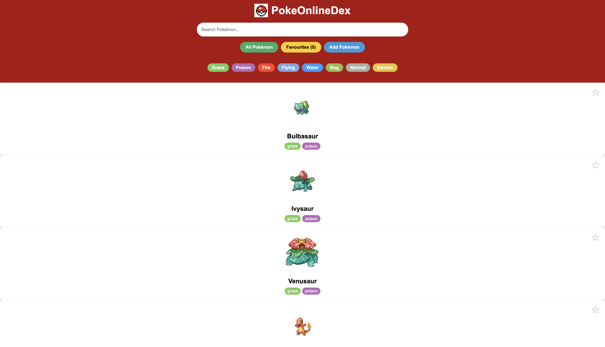

# PokeOnlineDex - Phase 1 Final project

An online pokedex that allows a user to peruse on diffrent pokemon types and favourite their cherished pokemon 
  

---

## Features

- **View pokemon card details**: Users will be able to view a plethora of diffrent pokemons including their names, stats, types, abilities etc.
- **Search functionality**: Users be able to seach through the index accordingly through pokemon names and filter the pokemon by their types 
- **Add Pokemon**: Users will be able to  add entirely new pokemon to the site
- **Favourite A Pokemon**: Users will be able to favorite a pokemon that they like, being represented by a red heart and being saved into a favorite section of the site 
---  

## How to Use
| Action | Result |
|--------|--------|
| Click card | View detailed stats |
| Click ☆ | Toggle favorite |
| Search box | Filter by name |
| Type buttons | Filter by type |
| "Add Pokémon" | Open creation form |

---

## Technologies Used

- HTML
- CSS
- Javascript
- PokeApi

---
## Author 

Neville Ng'ang'a 
